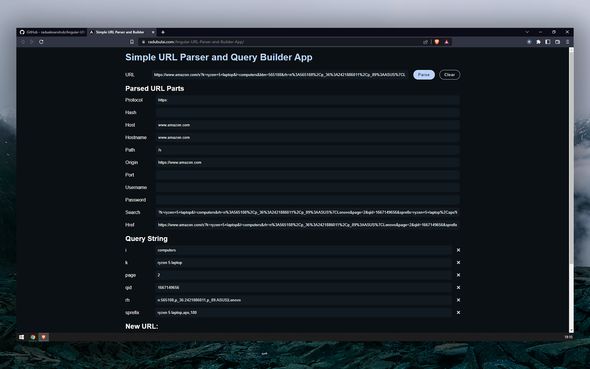
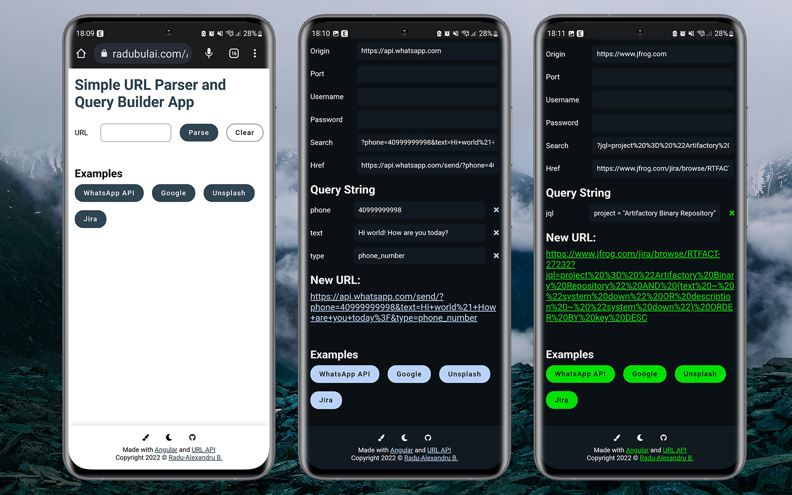
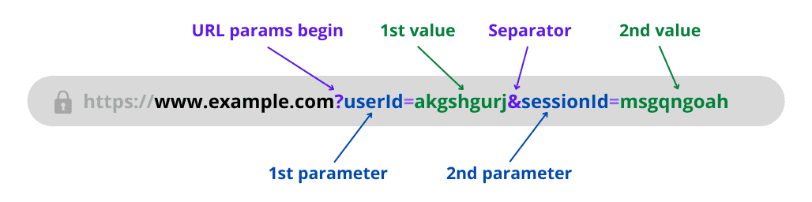

# Simple URL Parser and Query Parameter Builder App

Simple URL Parser and Builder Application based on URL's query parameters. Just enter the desired URL, modify its parameters, and use the new built URL according to your needs!

🚀 **Use the app right here** -> https://radubulai.com/Angular-URL-Parser-and-Builder-App/

🔵 This project was generated with [Angular CLI](https://github.com/angular/angular-cli) version 14.2.4.

## Features

- Enter your desired URL to see all of its components
- Modify URL's query parameters to get a new modified URL
- Responsive on every device
- Dark mode
- Choose your favorite accent color! - Useful when multiple instances (tabs) of this app are open simultaneously

## Screenshots





## Install Dependecies

Run `npm install`. Make sure you have [Node.js](https://nodejs.org/en/download/) installed (at least version 14/15/16).

```bash
npm install
```

Install Angular Command Line (Angular CLI) globally if it is not already installed (you can check by running `ng --version`).

```bash
npm install -g @angular/cli
```

## Development server

Run `ng serve` for a dev server. Navigate to `http://localhost:4200/`. The application will automatically reload if you change any of the source files.

## Code scaffolding

Run `ng generate component component-name` to generate a new component. You can also use `ng generate directive|pipe|service|class|guard|interface|enum|module`.

## Build

Run `ng build` to build the project. The build artifacts will be stored in the `dist/` directory.

## Deploy to GH-Pages

From [Deploying single-page Angular apps to GitHub Pages - LogRocket](https://blog.logrocket.com/deploying-single-page-angular-apps-to-github-pages/) article:

Since Angular CLI alone doesn’t support the GitHub Pages deployments, you’ll need to add the Angular GitHub Pages external library by entering the following command:

```bash
ng add angular-cli-ghpages
```

Now the CLI is ready to deploy your application into GitHub Pages. You can use the deploy command to deploy your current Angular application, as shown below.

```bash
ng deploy --base-href=/<repositoryname>/
```

The above command will build your application and push the final static files to the gh-pages branch. After the first successful deployment, GitHub will automatically enable the GitHub Pages feature for the new repository. More information is available in the Settings tab, under the GitHub Pages section.

## Running unit tests

Run `ng test` to execute the unit tests via [Karma](https://karma-runner.github.io).

## Further help

To get more help on the Angular CLI use `ng help` or go check out the [Angular CLI Overview and Command Reference](https://angular.io/cli) page.

## Resources used

- [JavaScript URL API Documentation](https://developer.mozilla.org/en-US/docs/Web/API/URL)
- [Solve blank page from index.html when running ng build](https://stackoverflow.com/questions/51718020/when-running-ng-build-the-index-html-does-nothing)
- [Deploying single-page Angular apps to GitHub Pages - LogRocket](https://blog.logrocket.com/deploying-single-page-angular-apps-to-github-pages/)

Inspiration:

- [Free Online URL Parser / Query String Splitter - freeformatter.com](https://www.freeformatter.com/url-parser-query-string-splitter.html)
- [URL Parser / Query String Splitter - appdevtools.com](https://appdevtools.com/url-parser-query-string-splitter)
- [How to Get URL Parameters in React - upbeatcode.com](https://www.upbeatcode.com/react/how-to-get-url-parameters-in-react/)



## License

Copyright (c) 2022 [Radu-Alexandru Bulai](https://radualexandrub.github.io/).

Released under [MIT License](./LICENSE).
